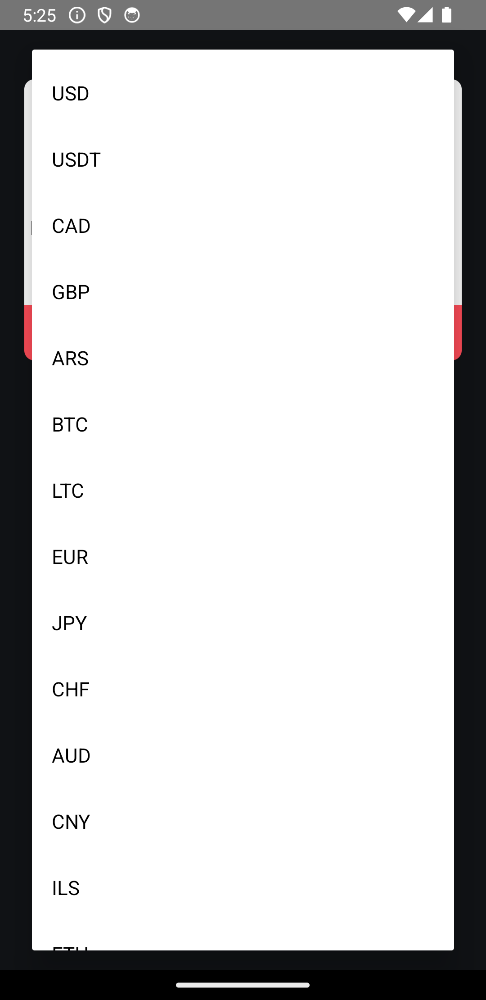
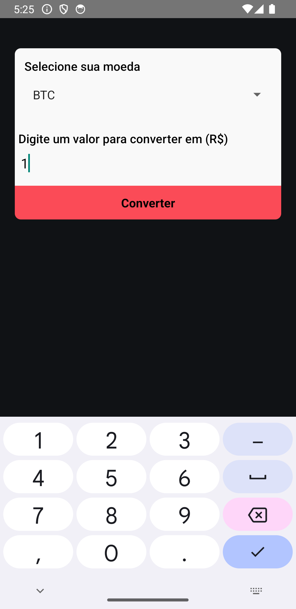
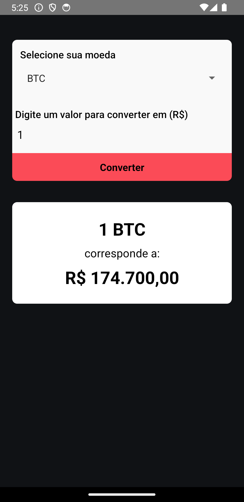

# React Native Movie App

## Purpose

- This React Native currency converter app allows users to convert between a variety of currencies, including Bitcoin (BTC), Ethereum (ETH), and many more. It uses an API to fetch the latest exchange rates and displays the converted amount in a user-friendly interface.

## Movie-app Preview

### Screenshot:

  
  <br>
  <br>
  
  <br>
  <br>
  
  <br>
  <br>
  

## Technologies Used

- React Native
- CLI
- Axios (for API requests)
- Picker - React Native

## How to Use

### Clone the repository to your local machine:

```bash
git clone git@github.com:FranciscoVieir/wallet-App.git
```

### Access the folder

```bash
cd walletApp
```

## Install dependencies:

```bash
npm install
```

#### or

```bash
yarn start
```

## Availble Scripts

In the project, directory, you can run the following scripts:

- npm run start or yarn start: Starts the CLI development server.
- npm run android or yarn android: Runs the app on an Android emulator/simulator.
- npm run ios or yarn ios: Runs the app on an iOS simulator.
- npm run eject or yarn eject: Ejects the app from CLI, if needed.
